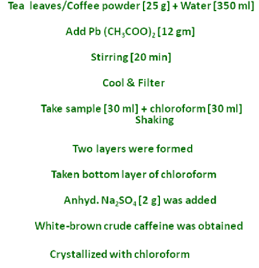
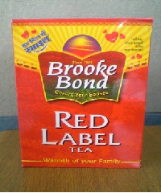
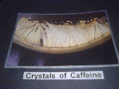
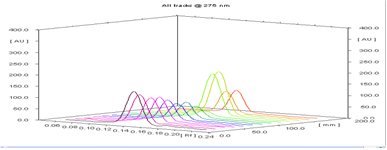
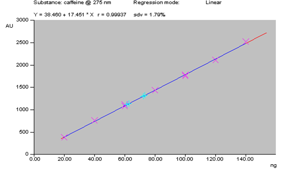
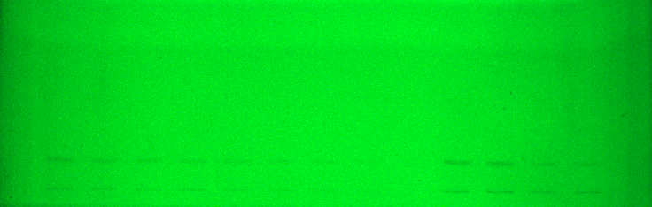

## Procedure

### (a) Extraction of caffeine from Tea leaves/coffee powder

<table>
  <tr>
    <td rowspan="5" width="70%">
      
    </td>
    <td width="30%">
      
    </td>
  </tr>
  <tr>
    <td width="30%">
      
    </td>
  </tr>
  <tr>
    <td width="30%">
      
    </td>
  </tr>
 
</table>

### (b) Qualitative and quantitative analysis of caffeine

- A stock solution of caffeine was prepared by dissolving caffeine (1 mg) in methanol (100 ml) in a volumetric flask. The solution was sonicated for 10 minutes over an ultrasonic bath, to obtain a homogenous solution.Similarly, the crystalline caffeine samples (extracted from tea/coffee) were dissolved in methanol and then sonicated for 10 min.
- The solution was filtered through Whatman No. 41 filter paper and filtrate was used as sample solution.
- A 20cm × 10cm aluminium backed HPTLC plate coated with silica gel
60 F 254 (E. Merck, Darmstadt, Germany) was used for analysis. They were pre-washed with methanol and dried in an oven at 65oC for 10 minutes.
- The samples were applied at 10 mm from the base of HPTLC plate by means of a Camag (Switzerland) Linomat V sample applicator using a syringe (100µL, Hamilton, Bonaduz, Switzerland).
- A linear calibration curve was obtained on applying the increasing concentration of standard caffeine in the range (20-140 ng). Extracted samples (4.8 and 200 µg) from tea and coffee respectively were also loaded on the same plate.
- HPTLC analysis was performed on a computerized densitometer scanner 3, controlled by winCATS planar chromatography manager version 1.4.4. (CAMAG, Switzerland).
- Plate was developed to a distance of 80 mm, in a Camag twin-trough chamber with mobile phase toluene: acetone, 4:1 (v/v).
- Plates were evaluated by densitometry at 275 nm with a Camag Scanner 3 for quantification.

### Observation

Use of pre-coated silica gel HPTLC plates with Toluene: Acetone:: 4:1, resulted in good separation of the caffeine at 275 nm (Rf = 0.13). The absence of additional peaks in chromatogram indicates non- interference of the common excipients used. Regression analysis of the calibration data for caffeine showed that the dependent variable (peak area) and the independent variable (concentration) were represented by the equations Y = 194.5 + 14.92 x for caffeine in tea and coffee. The correlation of coefficient (r2) obtained was 0.998 shows a good linear relationship.

  
  
   **Fig. 1**

  
 
  **Fig. 2**

  
  
   **Fig. 3**

<b>RESULTS:</b> Caffeine content in tea and coffee extract samples was found to be 8 and 12 mg/g with standard deviation 1.79 respectively.
