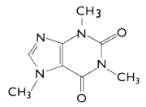

## Reagents

- Caffeine standard
- Tea leaves/Coffee powder/Energy drinks
- Lead acetate
- Anhydrous sodium sulphate
- Chloroform
- Toluene
- Acetone

All chemicals used in this study were of analytical grade.

## Theory

Caffeine (1, 3, 7-trimethylxanthine) is a pharmacologically active substance having property of temporarily warding off drowsiness and restoring alertness and therefore used as mild stimulant to central nervous system. It has been used as an ergogenic aid by many athletes. It also acts as freshener, anti fatigue, treats headache, reduces total sleep time and increase alertness. Presence of these properties of caffeine in beverages, soft cold drinks and newly launched energy drinks enjoy great popularity as they provide instant energy and reduce the sleep time.

  

An excessive intake of caffeine may lead to restlessness, irritability and insomnia. The food industry as well as academic and governmental institutions needs to assess the nutritional value of food and beverages for human health. Caffeine is found to be toxic, so there is a need to estimate a lethal dose of caffeine in edible items.

